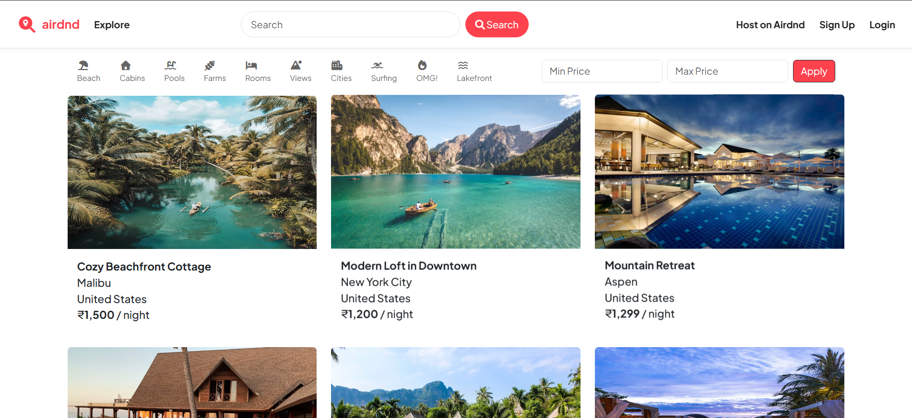
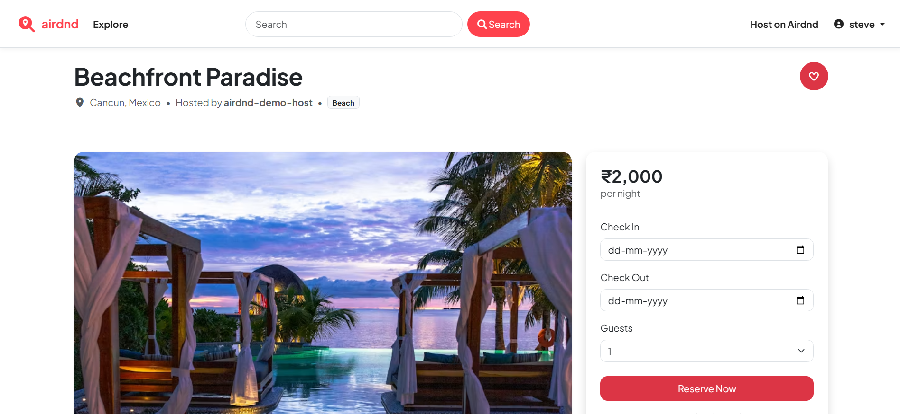
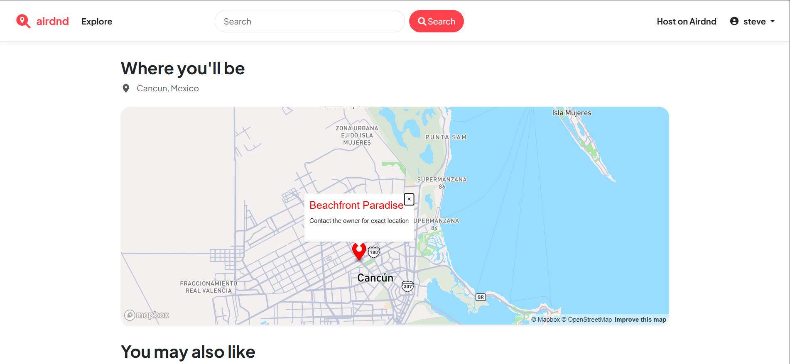
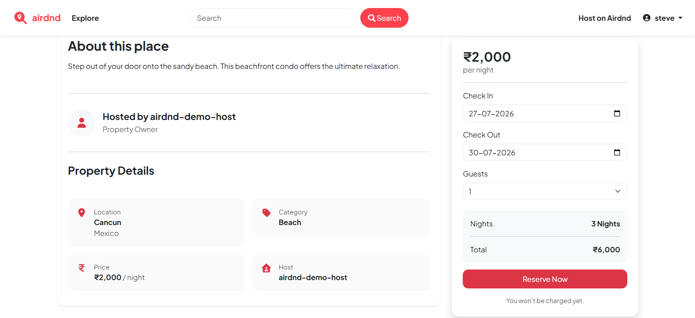
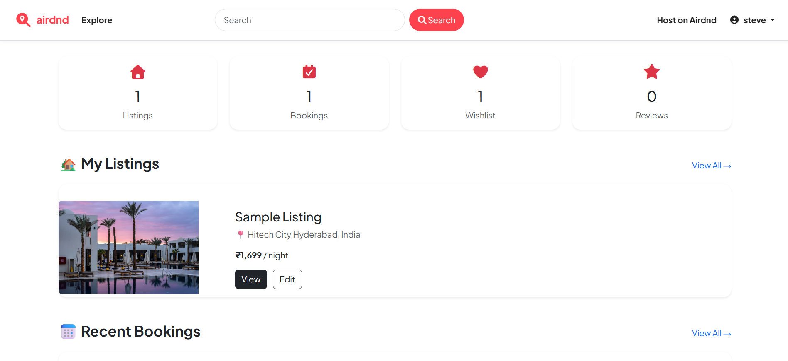

# Airdnd 

An Airbnb-inspired vacation rental platform built with the MERN stack to explore authentication, booking management, interactive maps, and cloud-based image uploads.

[Live Demo](https://airdnd-iqf9.onrender.com) | [GitHub Repository](https://github.com/Shashankreddy-12/Airdnd)


---

##  Screenshots

| Home Page | Listing Page |
| :---: | :---: |
|  |  |

| Listing Map View | Date Selection & Total Price | Profile Page |
| :---: | :---: | :---: |
|  |  |  |

---

##  Project Highlights

* **Full-Stack MVC Architecture**: Modular separation of concerns across Express routers, controllers, and Mongoose schemas.
* **Session-Based Authentication**: Authentication and persistent user sessions built with Passport.js and `connect-mongo`.
* **Interactive Maps powered by Mapbox**: Convert user-entered locations into map coordinates using Mapbox and display interactive maps on listing pages.
* **Cloud Storage Pipeline**: Multipart form handling with Multer and dynamic cloud image uploading via Cloudinary streams.
* **Overlapping Date Validation**: Server-side checks preventing concurrent bookings on matching date ranges.
* **Schema-Level Data Validation**: Request payload sanitization enforced through Joi validation middleware.
* **Resource Access Control**: Custom middleware restricting listing modifications and review deletions to verified owners.

---

##  Overview

Airdnd is a full-stack accommodation rental web application inspired by Airbnb, built to explore core web engineering patterns in the Node.js and Express ecosystem. The application enables users to discover rental properties, host their own venues, manage bookings, write reviews, and maintain personal wishlists.

The backend leverages Express routing and MongoDB for document persistence, while EJS templates render responsive views. The project focuses on secure authentication, authorization, booking validation, and third-party API integration while following the MVC architecture.

---

##  Features

* **User Authentication**: Register, log in, and manage persistent user sessions with hashed credentials.
* **Listing Management**: Create, update, and delete property listings with automated address geocoding.
* **Booking System**: Select check-in/check-out dates, compute total costs, and track active bookings.
* **Interactive Maps**: Display accurate location pins on Mapbox maps for every property.
* **Reviews & Ratings**: Post star ratings and comments on properties, with deletion rights limited to authors.
* **Search & Filters**: Search listings by keyword location or filter by category and price bounds.
* **Pagination**: Server-side pagination for browsing property listings seamlessly across multiple pages.
* **Wishlist**: Save and manage favorite properties on personal profile pages.
* **Responsive UI**: Mobile-friendly interface built using Bootstrap 5.

---

##  Tech Stack

| Layer | Technology | Purpose |
| --- | --- | --- |
| **Backend** | Node.js, Express.js | HTTP server, REST routes, and MVC request handling |
| **Database** | MongoDB, Mongoose | NoSQL data modeling and persistent document store |
| **Frontend** | EJS, ejs-mate, Bootstrap 5 | Dynamic HTML templates, layout inheritance, and responsive UI |
| **Authentication** | Passport.js, Express-Session, Connect-Mongo | User auth and MongoDB-backed session persistence |
| **Validation** | Joi | Backend schema validation for incoming request payloads |
| **External Services** | Mapbox SDK, Cloudinary, Multer | Forward geocoding, cloud image storage, and file upload stream |

---

##  Challenges & Learnings

* **Preventing Double Bookings**: Implemented MongoDB query logic ($lt / $gt comparison operators) in `controllers/booking.js` to detect date overlap before confirming new reservations.
* **Cloud Storage Lifecycle**: Handled Cloudinary asset deletion when properties are updated or deleted (`controllers/listing.js`) to prevent orphaned image files in remote storage.
* **Cascading Cleanup**: Designed Mongoose `findOneAndDelete` middleware hooks to clean up related reviews, user wishlists, and bookings whenever a listing is deleted.
* **Session Route Preservation**: Built custom middleware (`saveredirecturl`) to return users back to their target URL after performing required login actions.

---

##  Project Structure

```text
.
├── controllers/       # Business logic (listings, bookings, reviews, auth, wishlist)
├── models/            # Mongoose schemas (Listing, Review, User, Booking)
├── routes/            # Express endpoint definitions
├── views/             # EJS page layouts, partials, and templates
├── public/            # Static stylesheets and browser JS scripts
├── utils/             # Async utility wrappers and custom error classes
├── cloudconfig.js     # Cloudinary service configuration
├── middleware.js      # Route guard, ownership check, and Joi middleware
└── app.js             # Express application entry point & configuration
```

---

##  Running Locally

```bash
git clone https://github.com/Shashankreddy-12/Airdnd.git && cd Airdnd
npm install
# Configure .env with MONGO_URL, SECRET_CODE, MAP_TOKEN, CLOUDINARY_CLOUD_NAME, CLOUDINARY_KEY, CLOUDINARY_SECRET
npm run seed  # Optional: Seed sample database listings
npm start     # Server running at http://localhost:1202
```

---

##  Future Improvements

* Email notifications
* Availability calendar
* Advanced search filters
* Payment integration
* Image gallery
* Implement real-time host-to-guest messaging using Socket.io.

---

##  Project Status

✅ Completed and deployed on Render

This project serves as my first full-stack MERN application. Future updates will focus on improving the user experience and adding new features.

##  Author

**Lingala Shashank**
* GitHub: [@Shashankreddy-12](https://github.com/Shashankreddy-12)
* LinkedIn: [Shashank Reddy](https://www.linkedin.com/in/shashank-reddy12)
